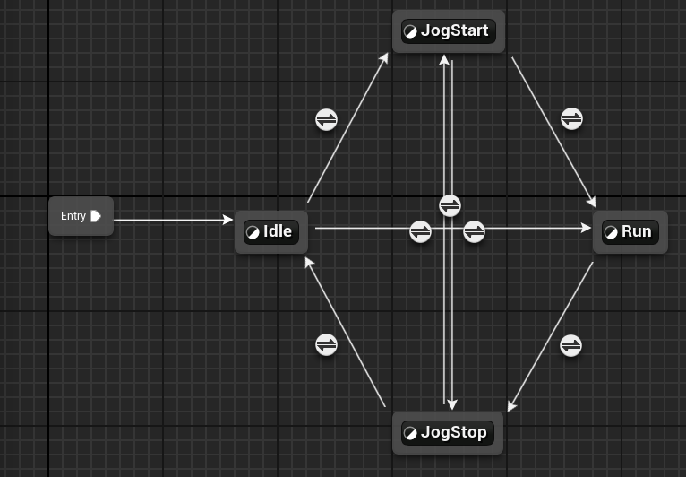
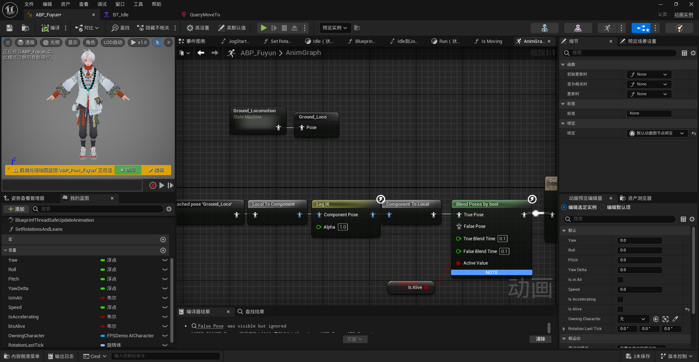
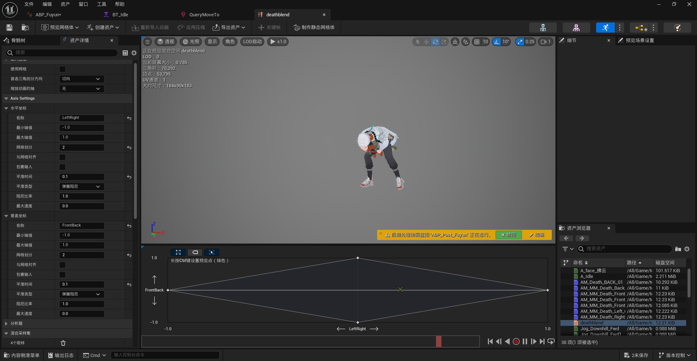
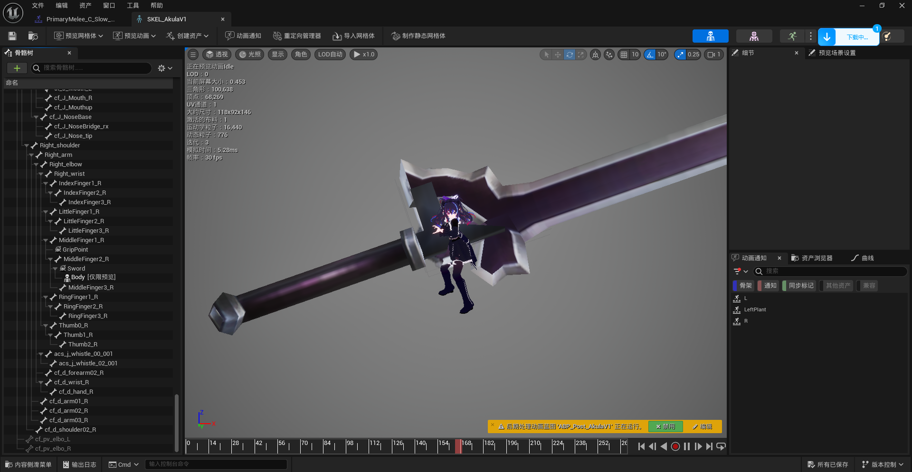
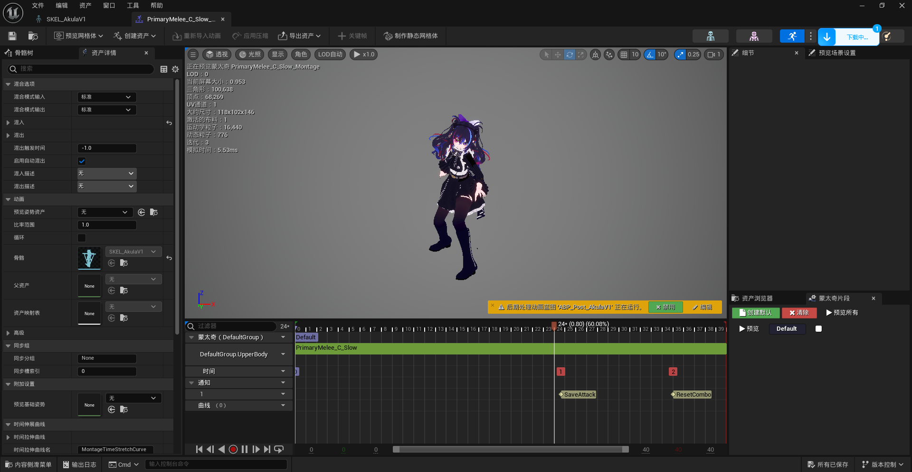

# CourseProject FPSDemo
### 第五周.骨骼动画

实现敌人的基础移动动画蓝图，并尽可能优化表现

实现敌人的死亡动画，并尽可能优化表现（如添加多方向死亡动画等）。

实现近战击败敌人的功能和动画表现（选做）

人物资源：https://www.vrcmods.com/item?id=10874

https://www.aplaybox.com/details/model/bFWFUST68TmE

动画资源：https://www.fab.com/zh-cn/listings/98ff449d-79db-4f54-9303-75486c4fb9d9

武器资源：https://www.fab.com/zh-cn/listings/8aeb9c48-b404-4dcd-9e56-1d0ecedba7f5

使用VRM4U导入人物资产，并重定向动画到新的骨骼网格体上。

### 1.基础移动动画蓝图

### 2.死亡动画

使用一个四个方向的动画序列生成混合空间，以及movement的运动方向。随后设置ragdoll。

### 3.近战攻击

为骨骼添加插槽

添加攻击的动画蒙太奇

### 10.TODO

1.只要一个端点击退出按钮就全部都退出了。

2.修改弹道，使之对准准心。

3.游戏中途加入，使用地址加入

4.会攻击的怪物

5.物体的交互

6.人物阴影悬浮

7.关卡设计

8.gamestate

9.关卡切换加载进度条无效，原来就是一个ui没什么功能

9.......
