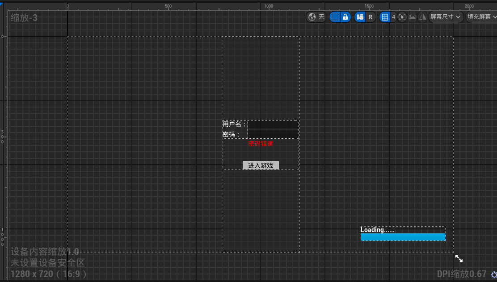
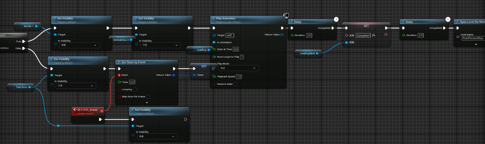
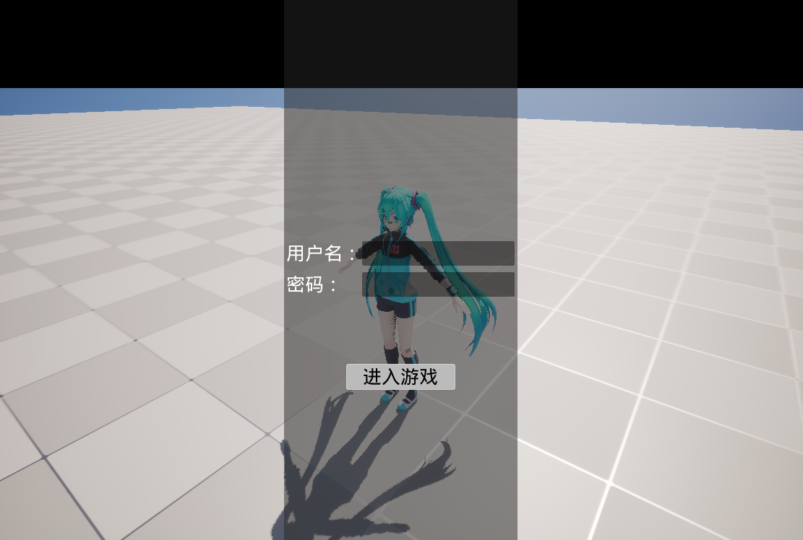
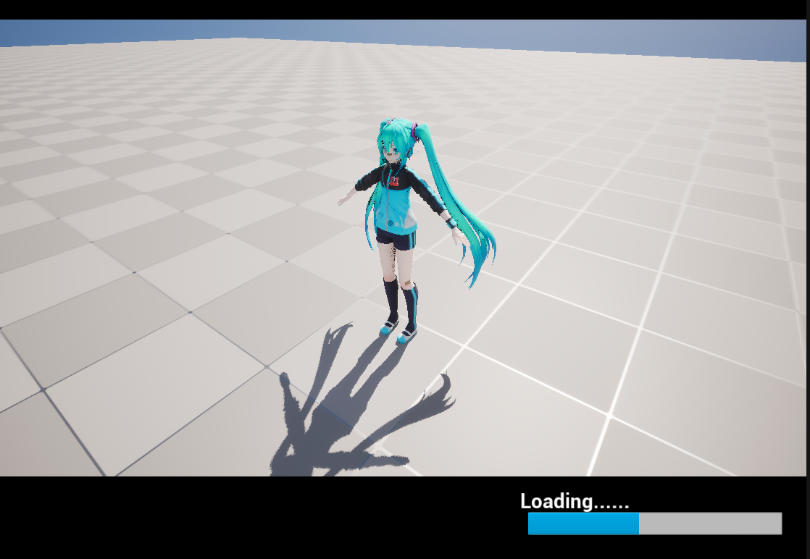
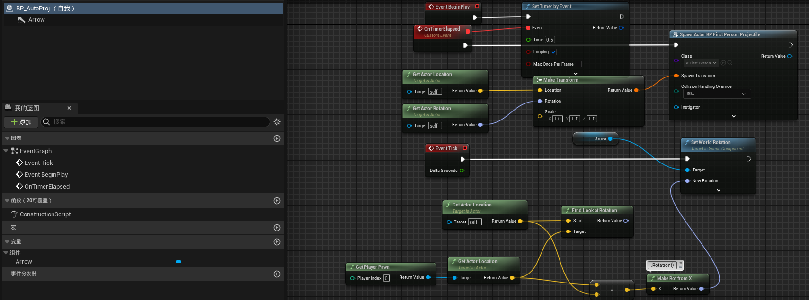
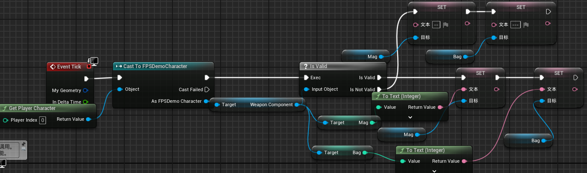
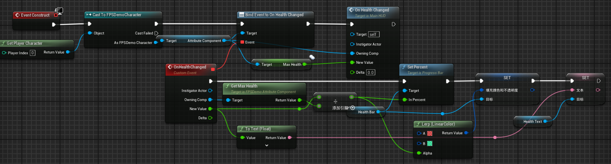
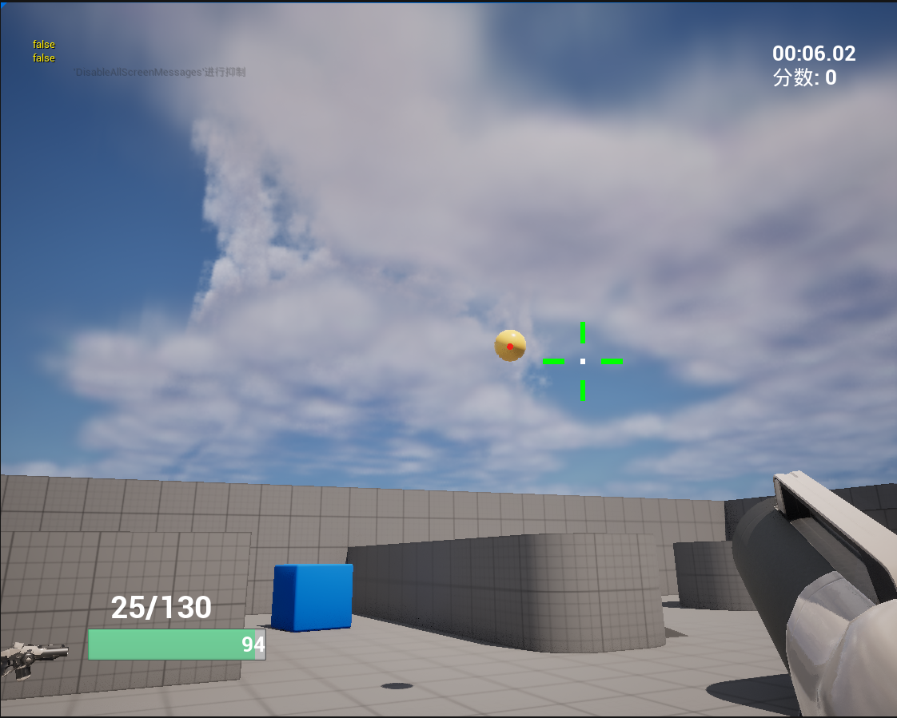
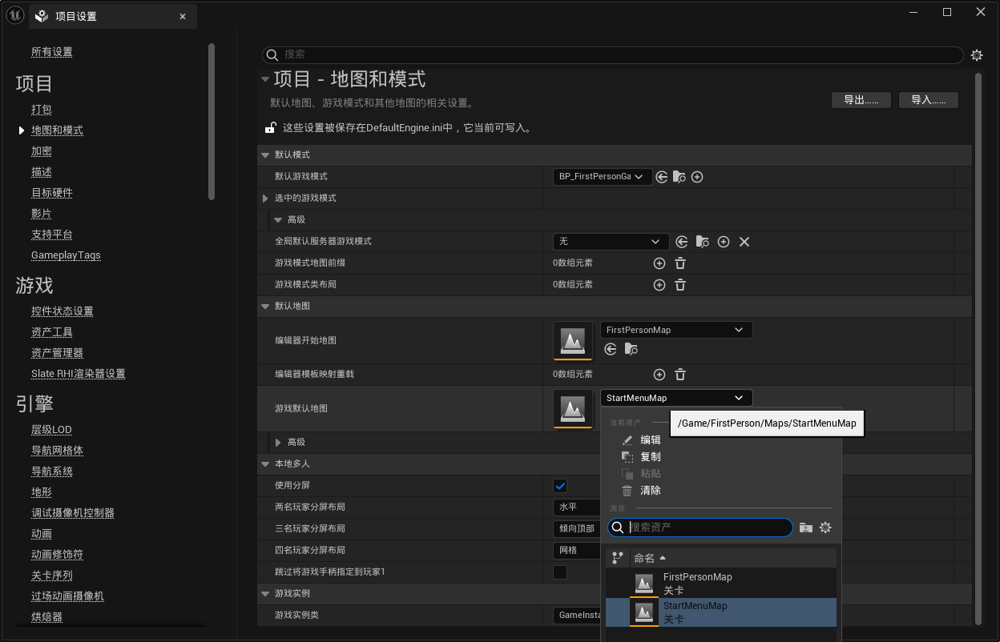

# CourseProject FPSDemo
### 第四周. UMG

实现登录界面(需要输入用户名和密码，其中密码加密显示，有确认按钮)

实现加载界面(要有动画表传达正在加载)

实现射击游戏操作面板(要有血条，子弹数，击中玩家会发生变化的准星

### 1.登录及加载界面

没继承用户控件,直接使用蓝图



其中的登录逻辑，首先判断用户名和密码是否相等，如果否，则设置定时器显示密码错误；如果是，则显示加载进度条，并且播放动画，加载完成后文本更改为Complete!，最后进入游戏的level。



需要新建一个level，其中使用一个新的gamemode，取消默认的Pawn类，在level中添加一个相机并自动添加到玩家0，显示HUD，显示光标，禁用相机控制。






### 2.游戏操作面板

添加一个新的Actor能够循环发射炮弹，每帧调整箭头的方向。



子弹数量的显示，首先需要Weapon中添加Mag,MaxMag,Bag三个变量，保存在客户端，每次开火时会修改值，当前只修改了值但是没做子弹不够的判断；后在Charactor类中添加一个指向Weapon的指针，在蓝图中访问，在PickUp函数中设置Charactor中的指针，在mainHUD中每帧更新，为什么不使用事件触发，因为事件写在Weapon类中，游戏开始没武器，蓝图中访问不到这个事件。



血量的显示，在第二周已经创建了一个AttributeComponent，多添加了MaxHealth的变量，后添加到Charactor类中，在蓝图中设置绑定事件，并在初始化中先调用一遍。





相机受击抖动，使用camerashake来实现，在Charactor中添加了AttributeComponent，添加Dynamic和子弹的OnHit中Charactor的判断

```c++
void AFPSDemoCharacter::OnHealthChanged(AActor* InstigatorActor, UFPSDemoAttributeComponent* OwningComp,
                                  float NewHealth, float Delta)
{
    if (IsLocallyControlled())
    {
       APlayerController* PC = Cast<APlayerController>(GetController());
       PC->PlayerCameraManager->StartCameraShake(HitCameraShake);

       //UGameplayStatics::PlaySound2D(this, JumpedSound);
    }
    if(!OwningComp->IsAlive())
    {
       bIsAlive = false;
       OnRep_IsAlive();
    }
}

void AFPSDemoProjectile::OnHit(UPrimitiveComponent* HitComp, AActor* OtherActor, UPrimitiveComponent* OtherComp, FVector NormalImpulse, const FHitResult& Hit)
{
	// Only add impulse and destroy projectile if we hit a physics
	if ((OtherActor != nullptr) && (OtherActor != this) && (OtherComp != nullptr) && OtherComp->IsSimulatingPhysics())
	{
		OtherComp->AddImpulseAtLocation(GetVelocity() * 100.0f, GetActorLocation());
		UFPSDemoAttributeComponent* AttributeComponent = Cast<UFPSDemoAttributeComponent>(OtherActor->GetComponentByClass(UFPSDemoAttributeComponent::StaticClass()));
		if (AttributeComponent != nullptr)
		{
			if (AttributeComponent->IsAlive())
			{
				if (AttributeComponent->GetShield() > 0)
				{
					AttributeComponent->ApplyShieldChange(GetInstigator(), -1);
					UE_LOG(LogTemp, Warning, TEXT("AFPSDemoProjectile::OnHit"));
				}
				else
				{
					AttributeComponent->ApplyHealthChange(GetInstigator(), -1.0f);
				}
			}
		}
		UGameplayStatics::SpawnEmitterAtLocation(this, ExplosionFX, GetActorLocation(), FRotator::ZeroRotator, FVector(5.0f));
		Destroy();
	}
    //There
	else if (Cast<AFPSDemoCharacter>(OtherActor) != nullptr)
	{
		UFPSDemoAttributeComponent* AttributeComponent = Cast<UFPSDemoAttributeComponent>(OtherActor->GetComponentByClass(UFPSDemoAttributeComponent::StaticClass()));
		if (AttributeComponent != nullptr)
		{
			if (AttributeComponent->IsAlive())
			{
				if (AttributeComponent->GetShield() > 0)
				{
					AttributeComponent->ApplyShieldChange(GetInstigator(), -1);
					UE_LOG(LogTemp, Warning, TEXT("AFPSDemoProjectile::OnHit"));
				}
				else
				{
					AttributeComponent->ApplyHealthChange(GetInstigator(), -1.0f);
				}
			}
		}
		Destroy();
	}
}
```

### 3.项目设置



### 10.TODO

1.只要一个端点击退出按钮就全部都退出了。

2.修改弹道，使之对准准心。

3.游戏中途加入，使用地址加入

4.会攻击的怪物

5.物体的交互

6.角色模型，当前只有手，而且多端不显示，没影子，像是贴图

7.关卡设计

8.gamestate

9.......
