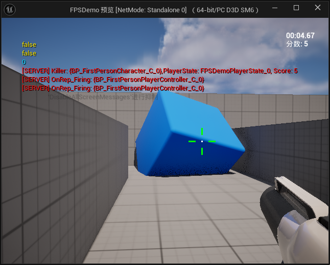
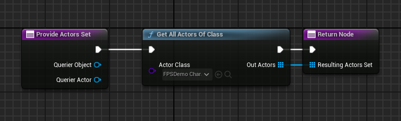
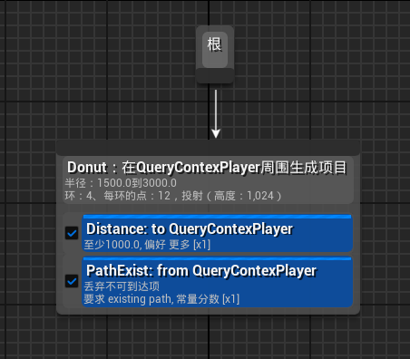
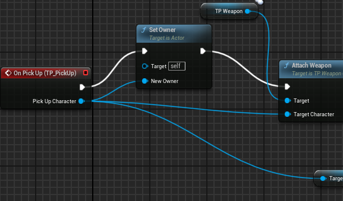
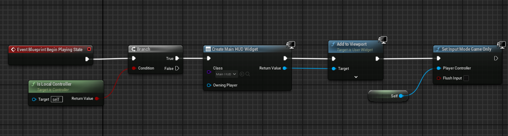
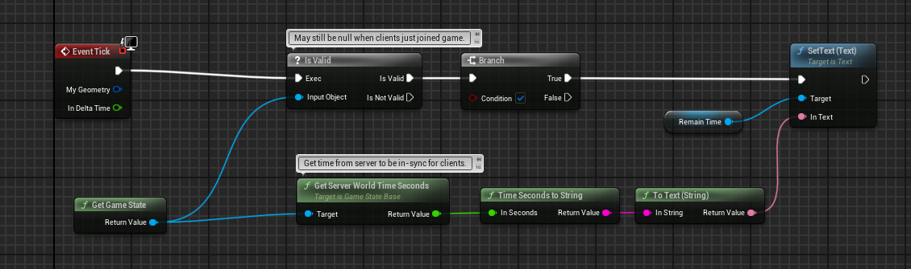
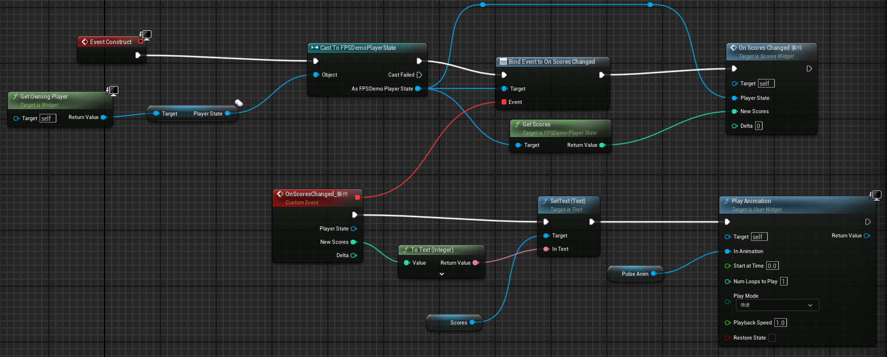
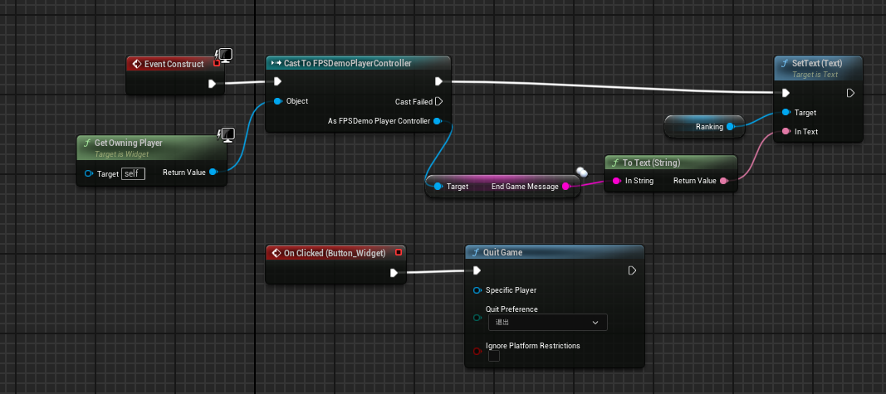

# CourseProject FPSDemo


基于ue5官方的First Person示例，实现一个游戏demo，本课程作业为实现以下功能:
一、物件规则:
1.射击命中方块，获得积分X分
2.方块被子弹命中后，缩放为Y倍，再次被命中后销毁
二、游戏流程：
1.游戏开始时随机N个方块成为“重要目标”，射击命中后获得双倍积分
2.游戏开始后限时T秒，时间到后游戏结算，打印日志输出每个玩家获得的积分和所有玩家获得的总积分
三、附加题，Nice to have
1.利用UMG制作结算UI替代日志打印
2.支持多人联机

Solution

添加模块时需要同时在build.cs和uproject中添加。

### 1.Attribute Component

构造一个继承自Actor Component的FPSDemoAttributeComponent类，赋予对象一些属性，现在包括float Health，int32 Shield，bool bIsBonus，FVector Color;Shield设置为整型用于抵挡计数的伤害，Color用于高亮显示Bonus物体的颜色。

Health和Shield共同决定Actor的存活，收到伤害时先扣除盾值，这两个数值可能后续会用于血条的ui。实现了2个事件用于广播通知所有绑定的事件对象血量变换，事件输入了Instigator和数值，当前只有投射物会使用该事件,所以在生成投射物的时候设置Instigator为武器的Character。

血量的变换只在服务端计算，判断HasAuthority来实现，尽管其他端的投射物击中了Actor，但是只会产生效果，不会减少血量。通过多播通知所有端，客户端再广播事件。如果对象死亡会通知GameMode来处理计算得分。

bIsBonus的设置只在GameMode中进行，GameMode根据一定的规则来设置，为这个变量绑定了一个OnRep(Replicated Property with RepNotify)函数，如果bIsBonus为真就修改材质中的Base Color参数；OnRep函数不在服务端自动执行，Gamemode修改时手动调用。

### 2.HittableActor

继承自AActor的类，绑定了StaticMeshComponent和FPSDemoAttributeComponent，设置了Attribute Component中的OnHealthChanged和OnShieldChanged事件；任务中方块被子弹命中后，缩放为Y倍，再次被命中后销毁，在此实现，将Shield设置为2，Health设置为0，OnShieldChanged中判断Delta<0,是的话 SetActorScale3D，**缩放倍数Y**暴露给蓝图设置；如果死亡后则取消碰撞并设置其生命周期为1秒，1秒后自动回收。


### 3.AFPSDemoProjectile

这个是First Person 中自带的Actor，修改了其中的OnHit函数，从OtherActor中获取属性组件，然后扣盾扣血。

### 4.UTP_WeaponComponent

这个是原来自带的骨骼组件，赋予角色开火的能力，主要增加了一个

```c++
UPROPERTY(ReplicatedUsing= "OnRep_Firing")
bool bIsFiring;

UFUNCTION(Server, Reliable)
void ServerFire();
```

修改了原来FIre的逻辑，将Fire中的Spawn，动作，声音都移动到OnRep_Firing中，在Fire中

```C++
if (!GetOwner()->HasAuthority())
{
    ServerFire();
    bIsFiring = true;
    OnRep_Firing();
}
else
{
    bIsFiring = true;
    OnRep_Firing();
}
FTimerHandle TimerHandle;
	GetWorld()->GetTimerManager().SetTimer(TimerHandle, this, &UTP_WeaponComponent::Stop, 0.2f, false);
```

而ServerFire只是调用Fire，在Stop中将bIsFiring设置为false。如果客户端开火，服务端运行Fire修改

bIsFiring状态，然后会调用所有客户端的OnRep_Firing函数，此时只要客户端的bIsFiring变量为false就会开火，这样可能导致等到计时器结束，多一次开火。

### 5.AFPSDemoPlayerState

继承的APlayerState类，用于计算用户时间和分数，用户时间用于中途加入的时间的计算，目前都是同时启动没使用。分数实现了一个事件用于通知分数变化，游戏中右上角的分数变化就基于此。此外游戏状态只有服务器和当前客户端所有，在服务器中的gamemode修改然后通过OnRep传递修改。

### 6.AFPSDemoPlayerController

自带的类，基本和PlayerState绑定。实现了

```
    UPROPERTY(ReplicatedUsing="OnRep_EndGame")
    bool bIsGameEnd;

    UFUNCTION()
    void OnRep_EndGame();
    
    UPROPERTY(BlueprintReadWrite, Replicated)
    FString EndGameMessage;
    
    void SetEndGame()
    {
       bIsGameEnd = true;
       if (IsLocalController())
       {
          OnRep_EndGame();
       }
    };
```

在GameMode中设计了一个计时器用于游戏结束，结束时就会遍历所有的PlayerController，然后设置结束标志和积分信息，EndGameMessage就是积分信息，换行通过"\n"实现，在结束界面中的信息是只有一条文本信息。

### 7.AFPSDemoGameMode

```c++
//动态生成HittableActor的上限
int32 AvailableSpawnBots;
//现存的数量
int32 ExsitsSpawnBots;

// 物体循环生成的计时器、生成函数；通过在场景中设置导航网格和场景查询对象，查询玩家附近的点中满足查询条件的前5%的点，其中选择一个生成。
FTimerHandle TimerHandle_SpawnBots;
void SpawnBotTimerElapsed();
void OnBotSpawnQueryCompleted(TSharedPtr<FEnvQueryResult> Result);
void OnSpawnActor(FVector SpawnLocation);

// 游戏结束计时器
FTimerHandle TimerHandle_GameEnd;
void GameEndTimerElapsed();

// 场景查询对象
UPROPERTY(EditDefaultsOnly, Category = "Spawn Info")
TObjectPtr<UEnvQuery> SpawnBotQuery;

//生成的对象类
UPROPERTY(EditDefaultsOnly, BlueprintReadOnly, Category = "Spawn Info")
TSubclassOf<AActor> SpawnClass;

//游戏时长，在蓝图中更改
UPROPERTY(EditDefaultsOnly, BlueprintReadWrite, Category = "GameSetting")
float InitialGameTimeLength;

//每个方块的分数
UPROPERTY(EditDefaultsOnly, BlueprintReadWrite, Category = "GameSetting")
int32 InitialCubeScore;

//最初的n个设置为双倍分数
UPROPERTY(EditDefaultsOnly, BlueprintReadWrite, Category = "GameSetting")
int32 InitialBonusCubeCount;

//方块生成间隔
UPROPERTY(EditDefaultsOnly, Category = "GameSetting")
float SpawnTimerInterval;
```

其他还使用了公开接口

```c++
virtual void InitGame(const FString& MapName, const FString& Options, FString& ErrorMessage) override;
virtual void OnActorKilled(AActor* VictimActor, AActor* Killer);

virtual void StartPlay() override;
```

在构造函数中设置了变量的一些初始值。在InitGame中遍历所有的AActor，然后得到一个方块的数组，打乱数组，将前n个方块的积分设置为双倍，后续在随时间生成的过程中使用随机数以0.3的概率设置方块。在OnActorKilled中为Killer带有的PlayerState加分。在StartPlay中设置方块生成和游戏结束的计时器，方块生成只有在当前方块小于设定的大小时才会执行，否则在这周期内就跳过。

### 8.AFPSDemoGameStateBase

目前没内容，可以将用户的积分排行榜放在这里，但是当前PlayerState对象的名称在服务器和客户端不一样，三个PlayerState在服务器端标记为0，1，2，但是在每个客户端，用户控制的PlayerState才为0；不知道每个PlayerState能不能在排行榜中找到自身，是否需要在PlayerState设置UUID。

### 9.蓝图

QueryContext



EnvQuery



Weapon



Controller



游戏中的时间



游戏中的分数，注册一个事件



游戏结束界面，一个背景模糊，一个文本，一个按钮



### 10.TODO

1.只要一个端点击退出按钮就全部都退出了。

2.修改弹道，使之对准准心。

3.游戏中途加入，使用地址加入

4.会攻击的怪物

5.物体的交互

6.角色模型，当前只有手，而且多端不显示，没影子，像是贴图

7.关卡设计

8.gamestate

9.......